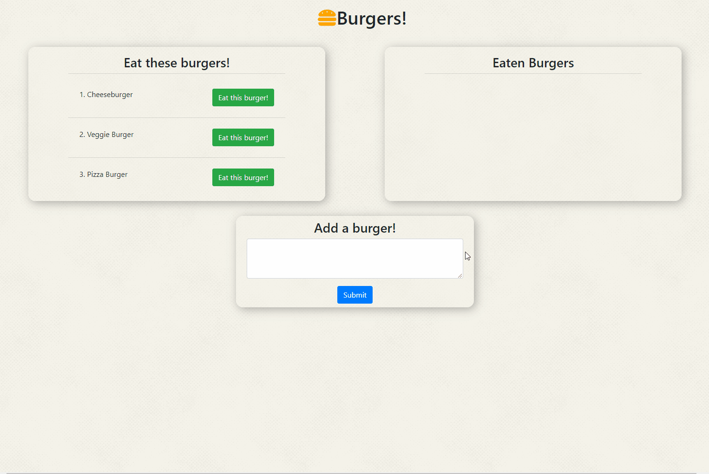

# Burger-Logger

## Overview
Burgers! is a restaurant app that lets users input the names of burgers they'd like to eat.
 
The app will then display the burger and be available to eat!
 
The user can then remove the burger from the list of eaten burgers
## Instructions
[Visit this link to try on Heroku](https://polar-cove-58923.herokuapp.com/)
 

### To Use
Click on a burger to eat or enter a new one!

 
## Built With
* node.js
* JavaScript
* HTML
* CSS
* jQuery
* [Bootstrap 4](https://getbootstrap.com/)-for CSS library
* [Font Awesome](https://fontawesome.com/?from=io)- for icons
* [express from npm](https://www.npmjs.com/package/express)-for interface in console
* [express-handlebars](https://www.npmjs.com/package/express-handlebars)-for html generation from server
* [MySQL](https://www.mysql.com/) - For database
* [MySQL](https://www.npmjs.com/package/mysql) - For database use in JavaScript
* [dotenv](https://www.npmjs.com/package/dotenv) - For hiding passwords
## Author
* Kayleigh Starr